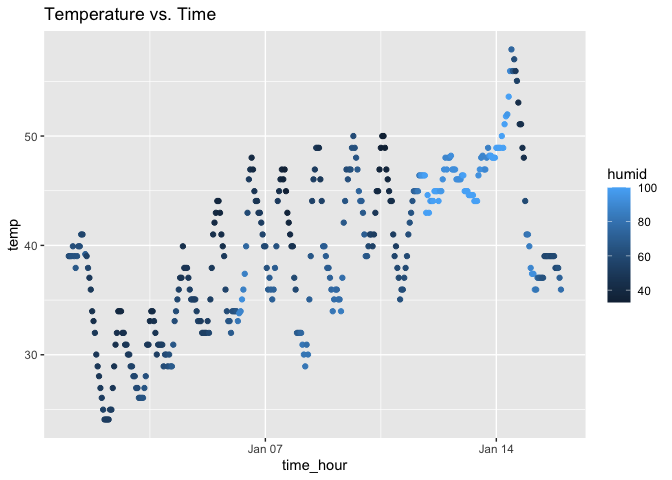

Homework 1
================
2023-09-14

# Loading Required Libraries

``` r
library(moderndive)
library(tidyverse)
```

# Problem 1

## Description of the dataset

``` r
data("early_january_weather")
?early_january_weather
nrow(early_january_weather)
```

    ## [1] 358

``` r
ncol(early_january_weather)
```

    ## [1] 15

``` r
early_january_weather %>%
  pull(temp) %>%
  mean()
```

    ## [1] 39.58212

Looking at “?early_january_weather”, the variables in the data set are
as follows: “origin” refers to the weather station the data came from;
the variables year, month, day, and hour describe the time of recording;
“temp” is the weather station’s temperature reading in Fahrenheit;
“dewp” is the dewpoint in Fahrenheit; “humid” is the relative humidity;
“wind_dir” is the wind’s direction in degrees; “wind_speed” is the wind
speed in miles per hour; “wind_gust” is the wind gust speed in miles per
hour; “precip” is the precipitation in inches; “pressure” is the
atmospheric pressure in millibars; “visib” is visibility in miles; and
finally time_hour is the day, month, year and time of the reading as a
single variable. The “early_january_weather” data set has 358 rows, and
15 columns. Finally, the mean of the temperature value is 39.58212
degrees.

## Creating and describing a scatterplot

``` r
early_january_weather %>% 
  ggplot(aes(x = time_hour, y = temp, color = humid)) + 
  geom_point() +
  labs(title = "Temperature vs. Time")
```

<!-- -->

``` r
  ggsave("temp_v_time_scatterplot.png")
```

    ## Saving 7 x 5 in image

From the plot, daily fluctuations in temperature are evident as well as
a general trend of increasing temperature throughout the month. That
being said, collection period doesn’t follow this trend as there is a
dip in temperature around January 15th. Furthermore, it is hard to
derive a trend about the humidity, but it appears that as the month
progresses there are more high humidity data points.

# Problem 2

## Creating the dataframe

``` r
set.seed(2023)


p2_df =
  tibble(
    num_samp = rnorm(10),
    log_vec = num_samp > 0,
    char_vec = c("This", "Is", "My", "Brand", "New", "Character", "Variable", "I", "Like", "it"),
    factor_vec = factor(c("great", "good", "bad", "bad", "good", "great", "great", "good",
"bad", "bad"), order = TRUE, levels =c("bad", "good", "great"))

    )
```

## Taking the means of each variable

Of the four variables, r can calculate the means of the random sample of
size 10 (num_samp) and the logical vector (log_vec). However it cannot
calculate the mean of the character vector (char_vec) and the factor
vector (factor_vec). This is because R can only find the means or
logical or numeric vectors.

``` r
p2_df %>% 
  pull(num_samp) %>% 
  mean()
```

    ## [1] -0.3450106

``` r
p2_df %>% 
  pull(log_vec) %>% 
  mean()
```

    ## [1] 0.2

## Converting the logical character to

``` r
p2_df %>% 
  pull(num_samp) %>% 
  as.numeric()

p2_df %>% 
  pull(log_vec) %>% 
  as.numeric()

p2_df %>% 
  pull(char_vec) %>% 
  as.numeric()

p2_df %>% 
  pull(factor_vec) %>% 
  as.numeric()
```

The code above runs for all of the variables except the character
variable (char_vec). This is because the sample from the normal
distribution is already numeric and is unchanged by as.numeric(). The
logical variable consists of TRUE and FALSE which can be converted into
0 or 1 by the as.numeric() function. The factor vector has 3 different
levels which have been assigned an order by me in the previous part of
this question. R can then assign each of these levels a 1, 2 or 3.
Finally, the character vector does not have any information that
as.numeric() can convert to numbers since it is text with no order.
